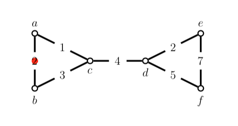

# Maximum-lifetime-paths
Let $G=(V, E)G=(V,E)$ be an undirected graph where each edge e in $e∈E$ has lifetime $l_e $ (the time we can expect the edge to work before it breaks down). We define the lifetime of a path $P$ to be the minimum lifetime of among edges in the path; that is, $l(P) = min_{e∈P} l_e$. For example, in the following graph $l(<b, c, d, e>) = 2$ while $l(<b, c, d, f, e>) = 3$

this project implements a polynomial time algorithm for finding the maximum lifetime path between two given nodes.

## Class Structure
- `Edge` - The edge class, takes two vertices and provides the lifetime between them.
    - `get_a()` - Returns vertex A of the edge.
    - `get_b()` -  Returns vertex B of the edge.
    - `get_lifetime()` - returns the lifetime of the edge.
- `Vertex` - The Vertex class, it holds the ID of the vertex and edges that the vertex is connected with.
    - `get_id` - Returns the ID of the vertex.
    - `get_edges` - Returns the map of edges.
    - `get_edge_to` - Takes a vertex and returns the edge (if exists, else null).
    - `add_edge` - Takes a vertex and an edge, adds the edge to this vertex's edge set.
- `lifetime_graph` - Holds a graph of vertices where the edges between vertices has a lifetime.
The graph is implemented using an adjacency list.
    - `add_edge(a, b, lifetime)` - add an edge to the graph, creating the Vertices (a) and (b) if they do not exist in the graph. 
        - `a` -  integer which is used as the ID of the vertex.
        - `b` - Integer which is used as the ID of the vertex.
        - `lifetime` -  The lifetime between the two vertices.
    - `edges()` - Returns an array of edges in the graph.
    - `lifetime_path(start_vertex, end_vertex)` - find the maximum lifetime path between two nodes. Returns an ARRAY of the edges IN ORDER FROM START TO END that fill the path.
        - `ststart_vertex` - integer (id) of the vertex to start the path.
        - `end_vertex` - integer (id) of the vertex to start the path.
